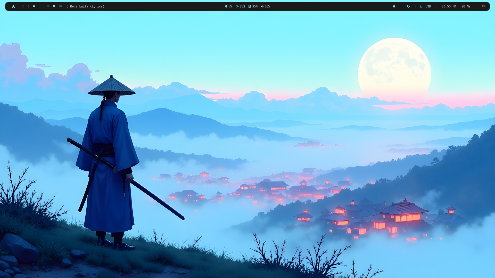

# i3-wm-dotfiles
i3-wm minimal cyan-monochrome setup for low-end pcs [ Working on it ]

# Note
It's not have animation .conf file.
Because it will be too much RAM consuming.

# Cyan-Monochrome Dotfiles 🗡️

A minimal lightweight i3-gaps rice built for low-end hardware.
Runs smoothly on a 2010 PC with just 2GB RAM!

## System Info
- OS: Archman Linux
- WM: i3-gaps
- Bar: Polybar
- Terminal: Alacritty
- Prompt: Starship
- Launcher: Rofi
- Music: MPD + mpc
- File Manager: Thunar
- Compositor: Picom
- Icons: Papirus-Dark
- GTK: Arc-Dark
- Font: JetBrainsMono Nerd Font
- Notifications: Dunst
- Lock Screen: i3lock-color

## Polybar Features
- Arch menu → Rofi launcher
- Workspace dots
- Music controls (MPD)
- CPU, RAM, Disk, Volume
- Notifications with history
- Screenshot tool
- Network with menu
- Smart battery (auto hides on PC)
- Clock in AM/PM format
- Power menu

## Credits
Guided & designed with Claude AI (Anthropic)
